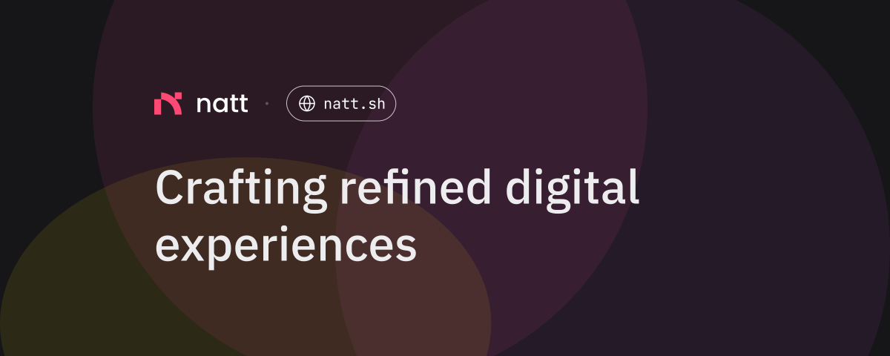

| Website                                       | Social                                                 | Web3                                                  |
| --------------------------------------------- | ------------------------------------------------------ | ----------------------------------------------------- |
| Portfolio: [natt.sh](https://natt.sh)         | GitHub: [nattui](https://github.com/nattui)            | Blue Sky: [natt.sh](https://bsky.app/profile/natt.sh) |
| Blog: [natt.sh/blog](https://natt.sh/blog)    | Twitter: [nattwasm](https://twitter.com/nattwasm)      | Ens: [natt.eth](https://natt.eth.co)                  |
| About: [natt.sh/about](https://natt.sh/about) | LinkedIn: [nattui](https://www.linkedin.com/in/nattui) | Lens: [nattwasm.lens](https://lenster.xyz/u/nattwasm) |
| RSS: [natt.sh/rss](https://natt.sh/rss.xml)   | Dribbble: [nattui](https://dribbble.com/nattui)        | Farcaster: [natt](https://warpcast.com/natt)          |

  

